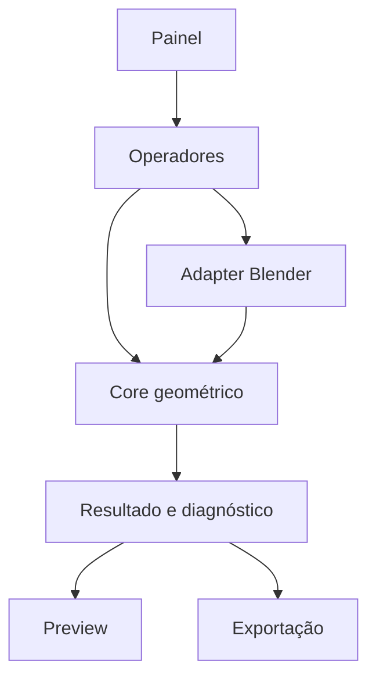

# Arquitetura para extensões do Blender e plano da Chest Part Splitter

> Documento de arquitetura, roadmap, testes e prompt de implementação.
> Objetivo imediato: criar uma extensão do Blender que divida modelos em peças por cor ou por região e gere encaixes com folga controlada para impressão 3D.
> Referência de organização: Chest Template Tool.

## 1. Como usar este documento

Este arquivo possui duas funções:

1. servir como padrão para futuras extensões internas do Blender;
2. ser um prompt executável por um agente de programação para criar a **Chest Part Splitter**.

O agente deve ler este documento inteiro antes de editar código. Cada fase termina com testes automáticos, um teste visual no Blender e uma entrega que o proprietário consiga experimentar. Não implementar todas as fases em uma única mudança.

## 2. Missão da Chest Part Splitter

Reduzir o trabalho manual entre a importação/modelagem de uma peça e sua preparação como partes imprimíveis, principalmente quando o objetivo é:

- separar regiões que serão impressas em cores diferentes;
- dividir um modelo grande ou complexo em peças menores;
- criar encaixes repetíveis entre as partes;
- controlar folga de montagem em milímetros;
- preservar o modelo original e permitir refazer a divisão;
- exportar cada parte de forma organizada para o fatiador.

A ferramenta deve ser útil para placas, bichinhos, chaveiros, vasos e modelos gerados por IA. Ela não deve depender do backend do Chest nem alterar a Chest Template Tool.

## 3. Princípios herdados da Chest Template Tool

Preservar os padrões que funcionaram na extensão anterior:

- extensão isolada e instalável por ZIP;
- pacote versionado e repositório próprio;
- painel em `Viewport 3D -> N -> Chest`;
- Python do Blender: `bpy`, `bmesh`, `mathutils` e biblioteca padrão;
- sem dependências `pip`, servidor web, telemetria ou automação por mouse na primeira versão;
- estado persistente no `.blend` por `PropertyGroup` e propriedades dos objetos;
- guias visuais separados da geometria imprimível;
- objetos originais preservados;
- operações com confirmação, preview e mensagens acionáveis;
- restauração de modo, seleção e objeto ativo após cada operador;
- instalação e atualização sem desativar outras extensões ou resetar preferências;
- testes no Blender real, e não somente validação de sintaxe Python.

Melhoria em relação à extensão anterior: desde o início, separar a lógica geométrica, o estado, os operadores da interface e a exportação. Booleanas e encaixes crescerão mais que a ferramenta de zonas de texto.

## 4. Decisões geométricas importantes

### 4.1 Quatro modos de divisão

#### Modo A — Plano

Um plano orientado divide um sólido em lado A e lado B. É o modo mais rápido e deve ser o primeiro implementado.

- O guia visual define origem, normal, rotação e tamanho.
- O tamanho visível do plano não limita o corte.
- O motor deve produzir duas malhas fechadas e tampadas.
- Para cortes realmente planos, preferir uma operação de bisseção/tampamento controlada; usar Boolean somente quando necessário.
- A normal do plano define qual resultado é A e qual é B.

#### Modo B — Cortador sólido personalizado

Um objeto fechado e manifold define uma região de corte. Pode ser uma caixa, cilindro, elipsoide, cápsula, texto extrudado ou qualquer forma modelada pelo usuário.

- Parte A = interseção entre alvo e cortador.
- Parte B = diferença entre alvo e cortador.
- O cortador não integra a exportação.
- Deve existir um comando para criar primitivas úteis: caixa, cilindro, elipsoide e cápsula.
- Também deve ser possível escolher qualquer objeto fechado como cortador.
- A extensão deve validar o cortador antes de executar a operação.

Uma curva, contorno 2D ou plano sem espessura não é automaticamente um cortador sólido. A interface deve oferecer `Dar espessura ao cortador` ou informar claramente o que falta.

#### Modo C — Assistido por materiais

O sistema analisa `material_index` das faces e ajuda a localizar regiões de cor. Este modo não deve prometer uma divisão correta em qualquer malha.

Há três casos diferentes:

1. **Objetos já separados por material/cor:** organizar, nomear, validar e exportar; não refazer booleanas sem necessidade.
2. **Sólidos sobrepostos com materiais diferentes:** detectar interseções e oferecer limpeza/recorte controlado.
3. **Uma única casca com faces de materiais diferentes:** os materiais informam apenas a fronteira na superfície; não definem como o corte atravessa o interior. A extensão pode realçar a borda, criar uma sugestão de cortador e pedir confirmação.

Texturas, cores pintadas em imagem, vertex colors e inferência semântica ficam fora da primeira versão. Elas exigem outra etapa de segmentação.

#### Modo D — Loop fechado de arestas

Requisito acrescentado em 2026-09-07: selecionar uma linha fechada na própria malha e usá-la para separar uma região ou gerar um cortador. Exemplo de aceite: selecionar o anel que envolve a pata de um gato, indicar o lado da pata e obter pata e corpo fechados, preservando o original.

Não exigir um edge loop regular de quadriláteros: aceitar qualquer ciclo simples de arestas conectadas, inclusive selecionado manualmente numa malha triangulada. Uma linha apenas desenhada sobre a superfície, sem arestas correspondentes, não entra neste modo inicial.

**Caminho D1 — Separar pela fronteira selecionada (preferido para a pata).**

1. Em Edit Mode, selecionar as arestas e clicar em `Capturar loop fechado`.
2. Validar um único componente conectado, pelo menos três vértices distintos, grau dois em cada vértice selecionado, ausência de ramificações, segmentos degenerados e auto-interseções.
3. O usuário indica uma face do lado da pata por `Definir região a separar`. Percorrer as faces adjacentes sem atravessar as arestas do loop.
4. Na componente alvo, verificar que essa fronteira realmente separa duas regiões. Um ciclo fechado em uma alça pode não separar a superfície; nesse caso, rejeitar com diagnóstico, sem escolher uma região arbitrária. Componentes não envolvidos permanecem no corpo e devem ser identificados no preview.
5. Duplicar as regiões em cópias de trabalho e construir uma superfície interna de fechamento com a mesma borda do loop. Compartilhar a mesma triangulação da tampa entre pata e corpo, com orientação oposta, para formar uma interface coincidente quando a folga de interface for zero.
6. Para loop plano, triangular o polígono com suporte a concavidade; não preencher por leque do centro sem validação. Para loop não plano, oferecer uma superfície triangulada proposta mantendo os vértices da borda originais. Não achatar o contorno silenciosamente.
7. A superfície proposta deve ficar dentro do volume original, sem cruzar a casca nem a si mesma. Bloquear confirmação se essas verificações não estiverem implementadas ou falharem. O primeiro pacote pode suportar somente loops planos e informar explicitamente que loops não planos ainda estão indisponíveis.
8. Mostrar pata/corpo, tampa interna e visualização explodida antes de confirmar. Validar fechamento, orientação, volumes positivos, conservação de volume e ausência de sobreposição volumétrica indevida.

Este caminho usa a fronteira topológica diretamente; não precisa fabricar um sólido auxiliar nem usar Boolean para a divisão inicial. Deve ficar disponível junto do botão de geração de cortador, pois resolve o exemplo da pata com menos operações.

**Caminho D2 — Criar cortador sólido a partir do loop.**

- Copiar o contorno sem remover arestas do alvo; gerar um objeto auxiliar editável.
- Para contorno plano, oferecer direção de extrusão, alcance positivo/negativo em mm e inversão. Tampar as extremidades e ligar as laterais para formar um prisma fechado, inclusive de seção oval ou irregular.
- Para loop quase plano, medir e mostrar o desvio máximo ao plano ajustado. A projeção no plano exige confirmação e não pode ser descrita como corte exato pelas arestas originais.
- Uma extrusão finita pode cortar outras regiões ou deixar partes além de seu alcance. Mostrar o volume inteiro do cortador e todas as regiões atingidas; nunca assumir que a extrusão selecionou semanticamente somente a pata.
- Para contorno não plano, não usar um n-gon como tampa implícita. Adiar a geração volumétrica até existir construção e validação de superfície e volume confiáveis; oferecer D1 quando suportado.
- Usar o motor do Modo B para diferença/interseção depois da validação do sólido. O contorno não cria automaticamente folga uniforme quando escalado.

**Folga e encaixes neste modo.** Reutilizar os conectores existentes após a divisão. Em tampa plana, permitir distribuição automática apenas dentro da região válida; em tampa não plana, iniciar com posicionamento manual e direção de inserção explícita. Separar `clearance_per_side_mm` do conector de `interface_gap_mm`, a distância entre as superfícies de contato das partes. A folga de interface começa em zero. Para interface plana, uma folga total g pode recuar cada tampa g/2 para dentro de sua parte, sem deslocar o conjunto; verificar novamente paredes e volumes. Offset de interface curva fica adiado até ser validado e não pode ser aproximado por escala global. Um fechamento curvo pode impedir a montagem mesmo com folga: testar a trajetória de inserção ou sinalizar que essa verificação continua manual.

### 4.2 Encaixes

O encaixe é uma operação ligada a um par de partes. Ele nunca deve ser aplicado antes de as duas partes de preview existirem.

Formas iniciais:

- pino cilíndrico com chanfro de entrada;
- chave tipo cápsula/retângulo arredondado, que impede rotação;
- pino cônico leve, opcional e explicitamente parametrizado;
- encaixe personalizado a partir de um objeto fechado, em fase posterior.

Evitar esfera como encaixe inicial: gera overhang e comportamento de folga menos previsível em FDM. Rabo de andorinha deve ficar para uma fase posterior, pois direção de montagem, fragilidade e tolerância tornam sua automação mais complexa.

Convenção de folga:

- `clearance_per_side_mm` é radial/por lado;
- o macho mantém a dimensão nominal;
- a cavidade fêmea usa a dimensão nominal mais a folga por lado;
- `end_clearance_mm` controla o espaço no fundo da cavidade;
- `insertion_depth_mm` controla a profundidade útil;
- chanfro/lead-in é configurado separadamente;
- a interface nunca deve chamar folga por lado de “folga total”.

Presets iniciais para calibração com PLA e bico de 0,4 mm:

| Preset | Folga por lado | Uso esperado |
|---|---:|---|
| Justo | 0,10 mm | impressora bem calibrada; pode exigir pressão |
| Normal | 0,15 mm | primeiro teste recomendado |
| Fácil | 0,20 mm | montagem manual fácil |
| Solto | 0,25 mm | peças grandes ou máquina menos calibrada |

Esses valores são hipóteses de teste físico, não garantias universais.

### 4.3 Posicionamento dos encaixes

Na primeira versão, encaixes automáticos são suportados em cortes planos:

- um encaixe central;
- dois ou mais distribuídos em linha;
- distribuição em grade para superfícies largas;
- margens mínimas da borda;
- distância mínima entre encaixes;
- botão para inverter macho/fêmea entre A e B.

Cada encaixe possui um marcador editável no plano local do corte. O usuário pode mover, duplicar, apagar ou desativar um marcador antes de confirmar.

Em cortadores curvos ou abstratos, começar com marcadores manuais orientados por uma face selecionada ou por um `Empty`. Não fingir que uma distribuição automática em superfície curva é confiável sem validação específica.

### 4.4 Modelo original, preview e confirmação

Fluxo não destrutivo:

1. registrar o objeto original;
2. criar uma sessão de corte com ID próprio;
3. gerar duplicatas temporárias em uma coleção de preview;
4. executar divisão e encaixes apenas nas duplicatas;
5. validar e permitir alternar visualização A/B/montado/explodido;
6. ao confirmar, criar partes finais em nova coleção e ocultar o original;
7. permitir `Restaurar original` e `Refazer sessão`.

Não aplicar modificadores, unir objetos ou apagar o original silenciosamente. Não acumular previews obsoletos a cada clique.

## 5. Experiência de uso

Painel: `Viewport 3D -> N -> Chest -> Part Splitter`.

### Etapa 1 — Alvo

- `Usar objeto selecionado como alvo`;
- mostrar nome, contagem de triângulos e dimensões físicas em mm;
- avisar sobre escala não aplicada, transformações singulares, normais inconsistentes, faces abertas e dimensões suspeitas;
- oferecer `Criar cópia de trabalho com transformações aplicadas` sem modificar o original.

### Etapa 2 — Divisão

- escolher `Plano`, `Cortador sólido`, `Loop fechado` ou `Materiais`;
- em `Loop fechado`: `Capturar loop fechado`, `Definir região a separar`, `Separar pela fronteira` ou `Criar cortador por extrusão`, alcance/direção e `Ver tampa interna`;
- criar/selecionar o guia;
- usar botões de alinhamento: vista, cursor, face selecionada e eixos X/Y/Z;
- inverter lado A/B;
- `Gerar preview`;
- exibir volume, bounds, manifold e quantidade de componentes de cada resultado.

### Etapa 3 — Encaixes

- ativar/desativar encaixes;
- escolher cilindro, cápsula ou cone leve;
- escolher parte que recebe o macho;
- diâmetro/largura, comprimento, profundidade, folga por lado, folga de fundo e chanfro;
- quantidade e distribuição;
- marcadores editáveis;
- preview separado de macho e cavidade;
- alerta de parede fina, encaixe fora da interface ou colisão com a superfície externa.

### Etapa 4 — Validar e confirmar

- `Validar sessão`;
- `Visualização montada`;
- `Visualização explodida` com distância ajustável;
- `Confirmar partes`;
- nomes determinísticos: `<original>__A`, `<original>__B` e sufixos adicionais em cortes futuros;
- registrar metadados da sessão nas partes finais.

### Etapa 5 — Exportar

- pasta de destino;
- STL binário separado por parte;
- opção de exportar na posição montada ou em layout explícito de impressão;
- relatório JSON opcional com unidades, nomes, volumes, bounds, parâmetros de corte e encaixe;
- confirmação antes de sobrescrever;
- escrita temporária seguida de substituição para evitar pacote parcial.

## 6. Arquitetura geral reutilizável para extensões Blender

Toda extensão interna deve separar cinco responsabilidades:

| Camada | Responsabilidade | Não deve fazer |
|---|---|---|
| Domain/Core | cálculos, validações e modelos de dados sem UI | depender de seleção ativa |
| Blender Adapter | converter objetos/meshes/contexto para o core | conter regras de produto |
| Operators | executar ações e controlar undo/erros | concentrar toda a geometria |
| UI | exibir estado e acionar operadores | modificar malha diretamente |
| IO/Export | serialização, nomes e escrita segura | mudar coordenadas silenciosamente |

Fluxo recomendado:



O core não precisa ser totalmente independente do Blender se a operação exige `bmesh`, mas cálculos de frames, tolerâncias, nomes, presets e diagnósticos devem ser funções pequenas e testáveis.

### Estrutura sugerida do repositório

```text
chest-blender-part-splitter/
├── README.md
├── ARCHITECTURE.md
├── CHANGELOG.md
├── LICENSE
├── pyproject.toml                 # apenas lint/test fora do Blender, se útil
├── scripts/
│   ├── build_extension.py
│   ├── run_blender_tests.py
│   └── install_local.py
├── fixtures/
│   ├── cube_130mm.blend
│   ├── irregular_manifold.blend
│   └── invalid_open_mesh.blend
├── tests/
│   ├── test_register.py
│   ├── test_plane_split.py
│   ├── test_connectors.py
│   ├── test_custom_cutter.py
│   ├── test_material_analysis.py
│   ├── test_loop_split.py
│   ├── test_persistence.py
│   └── test_export_roundtrip.py
└── source/
    └── chest_part_splitter/
        ├── blender_manifest.toml
        ├── __init__.py
        ├── registration.py
        ├── properties.py
        ├── constants.py
        ├── ui/
        │   └── panels.py
        ├── operators/
        │   ├── target.py
        │   ├── preview.py
        │   ├── split.py
        │   ├── connectors.py
        │   ├── commit.py
        │   └── export.py
        ├── core/
        │   ├── models.py
        │   ├── units.py
        │   ├── frames.py
        │   ├── validation.py
        │   ├── split_plane.py
        │   ├── split_solid.py
        │   ├── loop_boundary.py       # ciclo ordenado, regiões e planicidade
        │   ├── split_loop.py          # separação, tampas e validação
        │   ├── loop_cutter.py         # extrusão do contorno validado
        │   ├── connector_geometry.py
        │   ├── material_analysis.py
        │   └── naming.py
        └── blender/
            ├── context.py
            ├── mesh_access.py
            ├── collections.py
            ├── guides.py
            └── stl_writer.py
```

Na primeira fase, módulos pequenos podem ser agrupados. Não criar arquivos vazios apenas para imitar a árvore. Extrair um módulo quando houver uma responsabilidade real e um teste correspondente.

### Estado persistente

Usar um `PropertyGroup` de cena para a sessão ativa e propriedades customizadas nos objetos finais.

Estado mínimo da sessão:

- `session_id`;
- referência ao alvo original;
- modo de corte;
- referência ao guia/cortador;
- frame do corte;
- para loop: contorno ordenado capturado, face-semente/região, desvio de planicidade, estratégia de tampa, extrusão e folga de interface;
- assinatura da topologia de origem: não confiar somente em índices de vértices/faces após edição. Invalidar a captura quando a topologia mudar e pedir nova seleção. Modificadores que alteram topologia exigem uma cópia avaliada explícita antes da captura, sem correspondência inferida de índices;
- IDs das partes de preview;
- parâmetros e marcadores de encaixe;
- status `EMPTY`, `CONFIGURED`, `PREVIEW_VALID`, `PREVIEW_INVALID`, `COMMITTED`;
- versão do schema da sessão.

Referências a objetos não devem depender somente do nome visível. Validar ponteiros após load/undo e reconstruir guias derivados quando necessário.

### Registro e ciclo de vida

- `register()` e `unregister()` devem ser idempotentes durante desenvolvimento;
- registrar classes em ordem previsível e removê-las em ordem inversa;
- remover callbacks/handlers próprios ao desregistrar;
- não apagar objetos do usuário durante `unregister()`;
- separar dados persistentes de caches temporários;
- liberar meshes avaliadas e BMeshes temporárias;
- suportar save/reopen e undo/redo sem referências quebradas.

## 7. Robustez geométrica

### Entrada

Antes de cortar, verificar:

- objeto do tipo Mesh;
- coordenadas finitas;
- escala interpretável e unidade física conhecida;
- volume positivo quando aplicável;
- manifold/arestas abertas;
- faces degeneradas;
- normais consistentes;
- componentes desconectados;
- auto-interseções: detectar apenas se houver método confiável; caso contrário, emitir limitação clara;
- complexidade acima do limite configurado.

Não reparar automaticamente a malha original. Um reparo futuro deve operar em cópia e gerar relatório.

### Booleanas

- usar solver robusto/exato disponível na versão detectada do Blender;
- aplicar transformações em cópias de trabalho antes da operação;
- garantir orientação e volume do cortador;
- detectar resultado vazio, parte ausente, mudança absurda de volume e componentes indesejados;
- comparar `volume(A) + volume(B)` com o volume original dentro de tolerância explícita;
- validar a malha avaliada depois de cada booleana;
- nunca considerar a existência de um objeto de saída como prova de sucesso.

### Tolerâncias numéricas

Todas as tolerâncias devem ter nome e unidade. Evitar números mágicos.

Exemplos de constantes configuráveis no código:

- distância geométrica mínima em mm;
- tolerância relativa de conservação de volume;
- área mínima de face;
- distância mínima do encaixe à borda;
- espessura mínima ao redor da cavidade;
- limite de triângulos e tempo de preview.

Converter unidade física uma única vez. Não tentar corrigir silenciosamente um STL importado 1000 vezes maior ou menor.

## 8. Validação específica dos encaixes

Bloquear confirmação quando:

- macho não intersecta corretamente a parte que deve recebê-lo;
- cavidade não é alcançável pela direção de montagem;
- cavidade atravessa a parede externa fora da interface;
- há menos parede ao redor que o mínimo configurado;
- encaixe toca borda do corte;
- dois encaixes se sobrepõem;
- comprimento útil é zero/negativo;
- folgas são negativas ou não finitas;
- o resultado deixa de ser manifold;
- o encaixe cria componentes soltos inesperados.

Mostrar advertência, sem necessariamente bloquear, quando:

- razão comprimento/diâmetro indicar pino frágil;
- pino ficar paralelo à mesa na orientação de impressão atual;
- cavidade exigir suporte interno;
- folga escolhida ainda não tiver sido calibrada fisicamente.

## 9. Roadmap por fases e baterias de testes

Cada fase segue esta sequência:

1. executar baseline;
2. implementar somente o escopo da fase;
3. executar testes automáticos headless no Blender;
4. abrir fixture e fazer inspeção visual;
5. gerar ZIP instalável;
6. disponibilizar ao proprietário com roteiro de teste de até 10 minutos;
7. registrar testes executados, pendentes e limitações;
8. aguardar validação antes da fase seguinte quando a mudança alterar a geometria principal.

### Fase 0 — Fundação da extensão

Entregar:

- repositório independente;
- manifesto compatível com a versão REAL do Blender detectada;
- painel Chest Part Splitter;
- registro/desregistro;
- seleção de alvo;
- propriedades persistentes;
- coleção de guias e preview;
- diagnóstico básico de escala, dimensões e manifold;
- ZIP instalável.

Testes:

- registrar, desregistrar e registrar novamente;
- abrir/salvar/reabrir `.blend` sem perder alvo e configurações;
- objeto apagado ou renomeado não causa exceção;
- troca de modo e seleção é restaurada;
- cubo conhecido de 130 mm aparece como 130 mm;
- unidade inválida gera mensagem acionável;
- nenhuma outra extensão/preferência é alterada.

### Fase 1 — Corte por plano

Entregar:

- guia plano alinhável por vista, face, cursor e eixo;
- preview A/B;
- inversão dos lados;
- corte fechado;
- vista montada e explodida;
- confirmar/restaurar/refazer.

Testes automáticos:

- cubo 130 mm cortado ao meio: duas partes fechadas, bounds esperados e conservação de volume;
- corte inclinado 10°, 45° e quase tangente;
- alvo movido, rotacionado, com parent e escala não uniforme em cópia de trabalho;
- plano sem interseção deve bloquear;
- corte exatamente em vértice/aresta deve falhar de modo controlado ou produzir resultado validado;
- modelo com múltiplos componentes deve respeitar política documentada;
- 20 ciclos de gerar/limpar preview não acumulam objetos ou meshes.

Teste manual:

- importar uma placa real e um modelo simples de IA;
- posicionar plano;
- comparar montado/explodido;
- abrir as duas partes no Bambu Studio e conferir medidas.

### Fase 2 — Encaixes em cortes planos

Entregar:

- pino cilíndrico e cápsula;
- macho/fêmea invertível;
- folga por lado e folga de fundo;
- distribuição automática e marcadores manuais;
- chanfro de entrada;
- validações de borda, parede e sobreposição.

Testes automáticos:

- medir macho e cavidade e confirmar exatamente a convenção de folga;
- folgas 0,10, 0,15, 0,20 e 0,25 mm;
- um, dois e quatro encaixes;
- inverter macho/fêmea;
- parâmetros limite e inválidos;
- encaixe perto da borda, sobre parede fina e fora da interface;
- conservação de volume explicada pela adição/remoção do encaixe;
- exportar/reimportar STL e medir novamente.

Teste físico obrigatório antes de definir preset padrão definitivo:

- gerar corpo de prova pequeno com as quatro folgas;
- imprimir em PLA, bico 0,4 mm;
- registrar impressora, altura de camada, perfil, material, força de montagem e facilidade de desmontagem.

### Fase 3 — Cortador sólido personalizado

Entregar:

- primitivas caixa, cilindro, elipsoide e cápsula;
- escolha de objeto fechado existente;
- interseção/diferença;
- preview e validação do cortador;
- conectores manuais orientados por face/Empty.

Testes:

- cortadores convexos e côncavos simples;
- cortador rotacionado e escalado;
- cortador aberto, degenerado ou sem interseção;
- múltiplas ilhas resultantes;
- volume e manifold após diferença/interseção;
- teste com placa curva, bichinho e vaso de parede grossa;
- tempo e memória em malhas pequena, média e limite.

### Fase 3A — Loop fechado e separação da pata

Executar depois da Fase 3 e antes da assistência por materiais. É requisito explícito do fluxo do usuário, não apenas sugestão futura.

Entregar primeiro captura e validação do loop, D1 com tampa plana, D2 com extrusão plana, seleção da região, preview das tampas e conectores existentes. Loops não planos recebem diagnóstico claro nesta entrega; implementar seu fechamento numa etapa 3A.2 separada, condicionada às validações geométricas descritas no Modo D.

Testes obrigatórios:

- pata sintética ligada ao corpo: selecionar anel, indicar face-semente e obter exatamente pata/corpo fechados;
- anel oval, circular, côncavo e irregular; seleção manual sobre triângulos;
- loop aberto, ramificado, múltiplos loops, auto-interseção e ciclo não separador: rejeitar sem alterar original;
- loop plano inclinado, escala não uniforme e unidade conhecida;
- loop não plano: rejeição explícita na primeira entrega; na 3A.2, validar tampa interna e impedir cruzamento da casca;
- tampas coincidentes com orientação oposta, conservação de volume e zero sobreposição indevida com folga zero;
- extrusão que atinge outra pata: preview deve revelar essa região adicional;
- alcance insuficiente, cortador degenerado e resultado vazio: bloquear;
- persistência, undo/redo e mudança de topologia invalidando a captura;
- folga do conector independente da folga de interface, sem escala global da pata;
- exportar e reimportar pata/corpo para checar fechamento e medidas.

Teste manual de aceite: abrir gato real -> selecionar loop ao redor da pata -> capturar -> indicar lado da pata -> gerar preview -> inspecionar tampa -> inserir encaixe -> confirmar -> conferir as duas peças no fatiador. Testes de montagem física continuam necessários. A aprovação de D1 não significa que D2 ou loops não planos foram validados.

### Fase 4 — Assistência por materiais

Entregar:

- listar materiais e número de faces por material;
- destacar fronteiras entre `material_index`;
- reconhecer objetos já separados;
- criar sugestão de cortador para casos simples e exigir confirmação;
- relatório explícito sobre o que foi inferido.

Testes:

- objeto único com dois materiais em fronteira planar;
- fronteira fechada irregular;
- materiais desconectados;
- objetos separados com cores iguais/diferentes;
- material sem faces;
- demonstrar que textura de imagem não é tratada como segmentação geométrica;
- nunca alterar faces apenas por executar análise.

### Fase 5 — Exportação produtiva e acabamento

Entregar:

- STL binário por parte;
- posição montada e print-layout como opções explícitas;
- JSON de relatório;
- nomes determinísticos;
- presets salvos;
- histórico simples de sessões;
- documentação e exemplos.

Testes:

- roundtrip STL com bounds e volume;
- nomes duplicados e caracteres inválidos;
- confirmação antes de sobrescrever;
- falha durante escrita não deixa pacote parcialmente válido;
- exportar somente partes selecionadas;
- abrir resultados no fatiador alvo;
- teste de uma sequência real com dois cortes e quatro peças.

## 10. Matriz mínima de regressão

| Categoria | Casos obrigatórios |
|---|---|
| Unidades | mm correto, escala de cena diferente, importação suspeita 1000x |
| Transformações | rotação, escala não uniforme, parent, origem deslocada |
| Topologia | manifold, aberto, degenerado, múltiplos componentes, alta densidade |
| Corte | plano central, inclinado, tangente, sem interseção, cortador côncavo, loop da pata, ciclo aberto/ramificado/não separador, tampa não plana |
| Encaixe | cilindro, cápsula, 4 folgas, invertido, borda, parede fina |
| Estado | undo/redo, save/reopen, renomear/apagar alvo, recarregar extensão |
| Recursos | previews repetidos, liberação de meshes, limite de tempo/triângulos |
| Exportação | STL por parte, roundtrip, montado, print-layout, sobrescrita |

## 11. Critérios de aceite do MVP

O MVP está pronto quando o usuário consegue:

1. selecionar um modelo manifold;
2. criar e orientar um plano de corte;
3. visualizar duas partes fechadas;
4. adicionar um ou mais pinos cilíndricos ou tipo cápsula;
5. escolher folga por lado em mm;
6. inverter macho/fêmea;
7. validar, confirmar e restaurar sem perder o original;
8. exportar STLs separados;
9. reimportar ou abrir no Bambu Studio com medidas corretas;
10. imprimir um corpo de prova e registrar a folga aprovada.

Detecção por materiais e cortadores abstratos completos não bloqueiam o MVP. Eles vêm depois que o corte plano e os encaixes estiverem fisicamente validados. A solicitação de loop fechado é atendida especificamente na Fase 3A: não declarar a entrega completa do fluxo da pata antes de seus testes de aceite passarem.

## 12. Fora do escopo inicial

- segmentação por IA;
- interpretação de textura/imagem como volume;
- reparo universal de modelos gerados por IA;
- garantia de imprimibilidade para qualquer orientação;
- encaixe esférico, snap-fit flexível, rosca e rabo de andorinha automático;
- suporte automático a superfícies curvas para distribuição de encaixes;
- exportação 3MF colorida na primeira versão;
- integração com frontend, créditos ou backend comercial Chest;
- modificação da Chest Template Tool.

## 13. Prompt de implementação para o Antigravity

Copie a partir daqui ao iniciar a implementação:

---

Você é responsável por implementar a extensão **Chest Part Splitter** para Blender. Leia integralmente o arquivo `BLENDER_EXTENSION_AND_PART_SPLITTER_ARCHITECTURE.md` antes de agir. Use a Chest Template Tool apenas como referência de padrões; não altere seu repositório, seus arquivos ou sua instalação.

Objetivo do primeiro ciclo: executar somente a **Fase 0 — Fundação da extensão**. Não implemente corte, Boolean ou encaixes ainda, exceto stubs visuais claramente desativados se forem necessários para demonstrar o fluxo do painel.

Antes de escrever código:

1. leia `AGENTS.md` e instruções aplicáveis;
2. verifique `git status` e preserve mudanças existentes;
3. detecte sistema operacional, versão e executável REAIS do Blender;
4. localize a Chest Template Tool apenas para entender convenções de pacote, painel e instalação;
5. crie um repositório local separado chamado `chest-blender-part-splitter` em local aprovado pelo usuário;
6. apresente um plano curto com arquivos, comportamento e testes da Fase 0;
7. se o local exato do novo repositório não estiver claro, pergunte antes de criá-lo.

Requisitos da Fase 0:

- extensão instalável e versionada;
- painel `Viewport 3D -> N -> Chest -> Part Splitter`;
- escolher e exibir alvo;
- mostrar dimensões em mm, triângulos e diagnóstico básico;
- estado persistente no `.blend`;
- coleções próprias para guias e previews;
- nenhuma edição destrutiva do alvo;
- registro/desregistro confiável;
- ZIP instalável, README e CHANGELOG;
- testes headless e roteiro manual curto.

Restrições:

- usar `bpy`, `bmesh`, `mathutils` e biblioteca padrão;
- não adicionar dependências pip sem aprovação;
- não alterar preferências globais, outras extensões ou sessões não salvas;
- não fechar Blender à força;
- não publicar, criar repositório remoto, fazer push ou integrar com o backend Chest;
- não afirmar que algo foi testado visualmente quando somente rodou em background;
- nunca apagar ou modificar a malha original silenciosamente;
- restaurar seleção, modo e objeto ativo após operadores;
- separar testes executados de testes pendentes.

Testes mínimos da Fase 0:

- registrar/desregistrar/registrar sem erros;
- cubo de 130 mm medido corretamente;
- save/reopen preserva sessão;
- alvo renomeado ou apagado não quebra o painel;
- 20 ciclos de criar/limpar estruturas temporárias não acumulam dados;
- instalação/atualização afeta somente esta extensão;
- inspeção visual do painel no Blender real, se houver acesso à interface.

Ao concluir, entregue:

- caminho do repositório;
- ZIP instalável;
- versão real do Blender usada;
- arquivos criados/alterados;
- testes executados e resultados;
- testes pendentes;
- limitações e riscos;
- roteiro de teste de até 10 minutos para o proprietário.

Pare após a Fase 0 e aguarde a validação do proprietário antes de iniciar a Fase 1.

---

## 14. Prompt das fases seguintes

Depois de aprovada uma fase, usar este formato:

> Implemente somente a Fase N do arquivo `BLENDER_EXTENSION_AND_PART_SPLITTER_ARCHITECTURE.md`. Primeiro execute e registre o baseline da fase anterior. Preserve o modelo original e os formatos já aprovados. Apresente um plano curto, implemente a menor mudança coerente, execute todos os testes automáticos descritos para a fase e faça inspeção visual no Blender real quando disponível. Gere um novo ZIP versionado. Informe diferenças geométricas, métricas de volume/bounds, testes executados, pendências e roteiro manual. Pare ao concluir a fase e aguarde validação.

## 15. Definition of Done de qualquer extensão Blender futura

Uma extensão interna é considerada entregável quando:

- possui missão e não escopo claros;
- detecta e documenta a versão real do Blender suportada;
- instala/desinstala sem afetar outras extensões;
- preserva dados do usuário e pede confirmação para ações destrutivas;
- possui estado persistente versionado;
- separa UI, operadores, geometria, adapter e exportação;
- restaura contexto e libera dados temporários;
- tem mensagens de erro acionáveis;
- possui fixture com dimensão física conhecida;
- tem testes headless, teste visual e roteiro manual;
- gera pacote ZIP reproduzível e versionado;
- documenta testes executados, pendentes e limitações;
- não declara sucesso baseado apenas em sintaxe ou registro em background.

---

**Diretriz final:** priorizar primeiro um corte plano extremamente confiável e encaixes fisicamente calibrados. Somente depois ampliar para cortadores abstratos e assistência por materiais. A velocidade real virá de repetir um fluxo previsível, não de tentar automatizar todos os tipos de malha na primeira versão.
